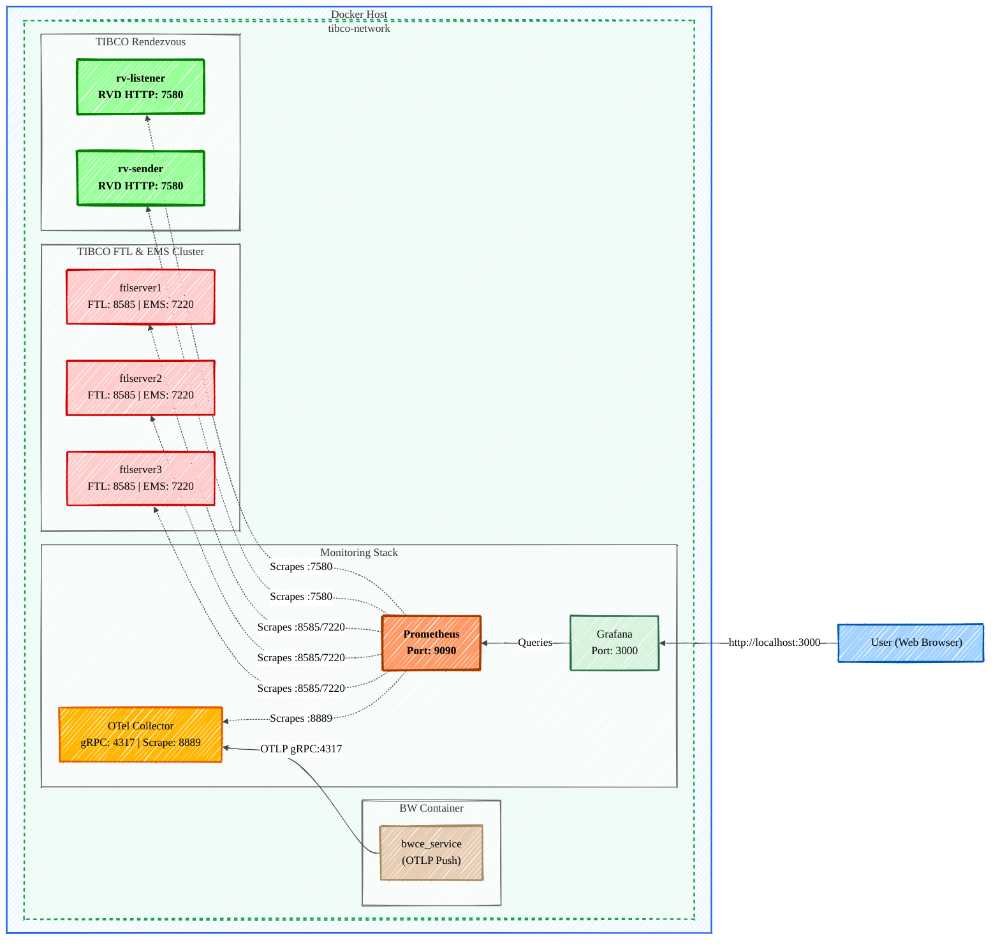
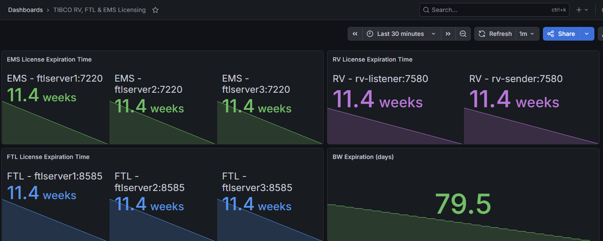

# 📊 TIBCO Monitoring: FTL, EMS, RV, and BW

This guide details how to expose, scrape, and visualize Prometheus metrics across a containerized TIBCO stack, including Messaging (FTL, EMS, RV) and Cloud Software Group BusinessWorks Container Edition (BWCE).

## 🏗️ Architecture & Port Mapping

The diagram below shows the monitoring flow. Messaging components are **scraped** directly by Prometheus, while BWCE **pushes** metrics to the OTel Collector via gRPC, which is then scraped by Prometheus.



The monitoring flow is designed so that Messaging components are **scraped** directly by Prometheus, while BWCE **pushes** metrics to the OTel Collector via gRPC, which is then scraped by Prometheus.

## 🔌 1. Exposing `/metrics` Configuration

### ⚙️ TIBCO BWCE (OTEL Collector)
BWCE uses the OpenTelemetry (OTLP) gRPC exporter to push metrics to a central collector.
* **Environment Variable:**
  BW_JAVA_OPTS=-Dbw.engine.opentelemetry.enable=true -Dbw.engine.opentelemetry.metric.enable=true -Dbw.engine.opentelemetry.metric.exporter.endpoint=http://otel_collector:4317
  
* **Collector Logic:** The OTel Collector receives gRPC traffic on `4317` and exposes an HTTP scrape endpoint for Prometheus on port `8889`.

### ✉️ TIBCO EMS (10.4+)
EMS metrics are exposed via the monitor port.
* **Flag:** `-monitor_listen http://<hostname>:7220` (Exposed as standard Prometheus text format).
* **Compose Port:** `7220`

### ⚡ TIBCO FTL (7.2+)
Natively exposed on the Realm Server port. No extra configuration required beyond ensuring connectivity.
* **Compose Port:** `8585`

### 📡 TIBCO Rendezvous (RV 9.0+)
Metrics are exposed via the `rvd` HTTP administration interface.
* **Flag:** `rvd -http 7580 &`
* **Compose Port:** `7580`

---

## 📈 2. Dashboard PromQL Rules

Below the PromQL for all products

### ✉️ EMS/FTL/RV/BW Expiration
| Component | PromQL Query |
| :--- | :--- |
| **EMS** | max by (instance) (tibco_ems_server_license_expiration_seconds) |
| **FTL** | max by (instance) (tibco_ftl_server_license_expiration_seconds) |
| **RV** | max by (instance) (tibco_rv_lease_expiration_seconds) |
| **BW** | app_metrics_com_tibco_bw_license_expiration_seconds / 86400 |

---

## 🧪 3. Running the Stack

### ▶️ Start all containers
Ensure your `prometheus.yml` and `otelcol-config.yaml` are present in the directory.
```bash
docker-compose up -d
```



### 🛑 Stop all containers
```bash
docker-compose down
```

