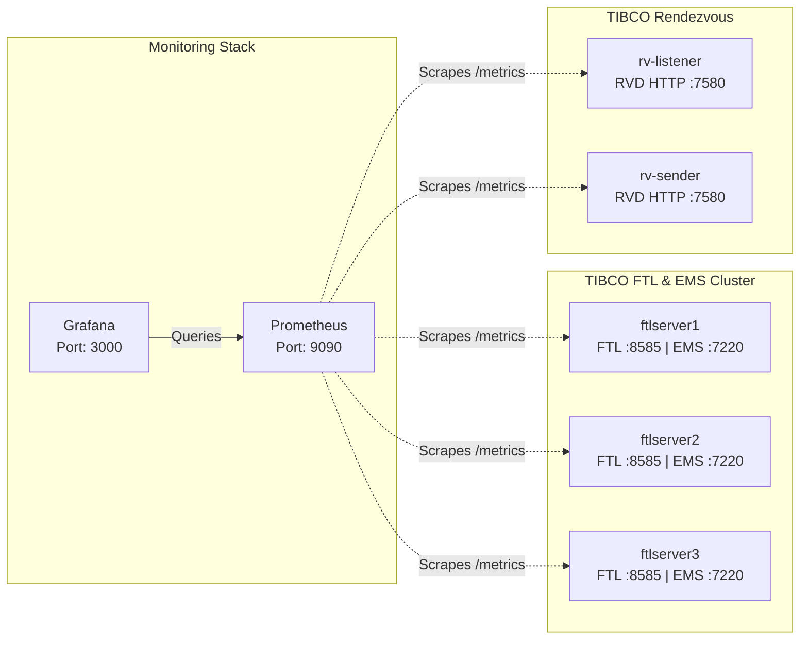

# TIBCO Messaging Monitoring: FTL, EMS, and RV

This guide details how to expose, scrape, and visualize Prometheus metrics across a containerized TIBCO messaging stack (FTL, EMS, and Rendezvous), with a specific focus on tracking software license expiration times.

## Architecture & Port Mapping

The following diagram illustrates how the Docker containers communicate and how Prometheus scrapes the metrics from each specific port.



## 1. Exposing `/metrics` in Docker Compose

Each TIBCO component handles Prometheus metrics slightly differently. To expose them, your `docker-compose.yml` must configure the correct flags and ports for each service.

### TIBCO EMS
EMS exposes its metrics via the monitor port.
* **Flag:** `-monitor_listen http://<hostname>:7220` (Configured in your `tibftlserver_cluster.yaml` under the `tibemsd` section).
* **Compose Port:** `7220`

### TIBCO FTL
FTL natively exposes Prometheus metrics on its Realm Server port. No special flags are needed, just ensure the port is accessible.
* **Compose Port:** `8585`

### TIBCO Rendezvous (RV 8.8+)
RV exposes metrics via the Rendezvous Daemon (`rvd`) HTTP administration interface. Client tools (`tibrvsend`/`tibrvlisten`) do not expose metrics directly; you must start the daemon explicitly with the HTTP flag.
* **Flag:** Start the daemon using `rvd -http 7580 &` before running your client commands.
* **Compose Port:** `7580`

**Example RV Sender Compose Command:**
```yaml
command: >
  bash -c "rvd -listen tcp:7500 -http 7580 & sleep 5; while true; do tibrvsend -service 7500 -network ';' -daemon tcp:7500 TEST.SUBJECT 'Ping'; sleep 10; done"
```

## 2. Test docker compose 

### Requirements 
* EMS,FTL and RV images built
* Valid and not expired license file 

### Start all containers
```bash
docker-compose -f docker-compose.yml up -d
```


`license-dashboard.json` delivered as sample to be imported to Grafana after the start of all containers 

### Stop all containers
```bash
docker-compose -f docker-compose.yml down
```

